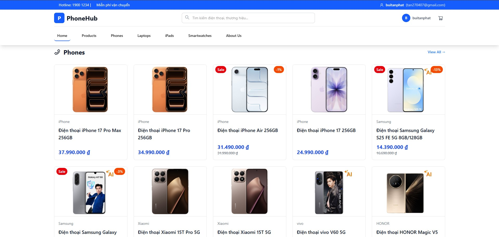

# 🧠 PhoneHub

**PhoneHub** là nền tảng mua sắm điện thoại thông minh, laptop, tablet và phụ kiện công nghệ chính hãng hàng đầu Việt Nam. Ứng dụng cung cấp trải nghiệm mua sắm trực tuyến hiện đại với giao diện thân thiện, tốc độ tải nhanh và hệ thống quản trị mạnh mẽ.

## 🚀 Demo / Preview



- **Live Demo**: [https://phonehub.io.vn](https://phonehub.io.vn)
- **Repository**: [https://github.com/buitanphat247/Project-frontend-nextjs-phonehub](https://github.com/buitanphat247/Project-frontend-nextjs-phonehub)

## 📁 Cấu trúc thư mục

```
Project-NextJs-PhoneHub/
├── app/                          # Next.js App Router
│   ├── (admin)/                  # Route group cho admin panel
│   │   ├── admin/                # Trang quản trị
│   │   │   ├── categories/       # Quản lý danh mục
│   │   │   ├── products/         # Quản lý sản phẩm
│   │   │   ├── users/            # Quản lý người dùng
│   │   │   ├── roles/            # Quản lý vai trò
│   │   │   ├── ranks/            # Quản lý cấp bậc
│   │   │   ├── settings/         # Cài đặt hệ thống
│   │   │   └── test-connection/  # Kiểm tra kết nối API
│   │   ├── dashboard/            # Dashboard admin
│   │   ├── components/           # Components dùng chung cho admin
│   │   └── layout.tsx            # Layout cho admin
│   ├── (home)/                   # Route group cho trang chủ
│   │   ├── page.tsx              # Trang chủ
│   │   ├── products/             # Trang sản phẩm
│   │   ├── phones/               # Trang điện thoại
│   │   ├── laptops/              # Trang laptop
│   │   ├── ipads/                # Trang iPad
│   │   ├── smartwatches/         # Trang đồng hồ thông minh
│   │   ├── cart/                 # Giỏ hàng
│   │   ├── favourite/            # Sản phẩm yêu thích
│   │   ├── account/              # Tài khoản người dùng
│   │   ├── about/                # Giới thiệu
│   │   ├── vnpay-payment/        # Thanh toán VNPay
│   │   ├── components/           # Components cho trang chủ
│   │   ├── hooks/                # Custom hooks
│   │   └── layout.tsx            # Layout cho trang chủ
│   ├── api/                      # API Routes
│   │   ├── proxy/                # API proxy
│   │   ├── v1/                   # API version 1
│   │   └── vnpay/                # VNPay payment API
│   ├── components/               # Components dùng chung
│   │   ├── auth/                 # Authentication components
│   │   └── layout/               # Layout components (Header, Footer)
│   ├── styles/                   # Global styles
│   ├── globals.css               # Global CSS
│   ├── layout.tsx                # Root layout
│   └── metadata.ts               # SEO metadata
├── lib/                          # Thư viện và utilities
│   ├── api/                      # API clients
│   │   ├── auth.ts               # Authentication API
│   │   ├── products.ts           # Products API
│   │   ├── cart.ts               # Cart API
│   │   ├── orders.ts             # Orders API
│   │   ├── payments.ts           # Payments API
│   │   └── server/               # Server-side API utilities
│   └── utils/                    # Utility functions
│       ├── apiClient.ts          # API client configuration
│       ├── auth.ts               # Auth utilities
│       ├── cache.ts              # Cache utilities
│       └── cookie.ts             # Cookie utilities
├── public/                       # Static files
│   ├── logo.png                  # Logo
│   └── banner.jpg                # Banner images
├── middleware.ts                 # Next.js middleware
├── next.config.ts                # Next.js configuration
├── tailwind.config.js            # Tailwind CSS configuration
├── tsconfig.json                 # TypeScript configuration
└── package.json                  # Dependencies
```

## 🧩 Công nghệ sử dụng

| Công nghệ | Mô tả |
|-----------|-------|
|  | Framework React với App Router, SSR, SSG, và API Routes |
|  | Thư viện UI với Hooks và Server Components |
|  | Ngôn ngữ lập trình với type safety |
|  | Framework CSS utility-first |
|  | Component library với design system |
|  | UI component library |
|  | Animation library cho React |
|  | Toast notification library |
|  | Analytics và monitoring |

### Backend API
- **NestJS API** hoặc **Express** *(tùy theo backend của bạn)*
- API endpoint: `NEXT_PUBLIC_API_URL`

### Deployment
- **Vercel** - Platform được khuyến nghị cho Next.js
- **Docker** - Containerization (có file `README.DOCKER.md`)
- **Netlify** - Alternative deployment option

## ⚙️ Cài đặt & Chạy

### Yêu cầu hệ thống
- Node.js >= 18.0.0
- npm >= 9.0.0 hoặc yarn >= 1.22.0

### Bước 1: Clone dự án

```bash
git clone https://github.com/buitanphat247/Project-frontend-nextjs-phonehub.git
cd Project-frontend-nextjs-phonehub
```

### Bước 2: Cài đặt dependencies

```bash
npm install
# hoặc
yarn install
# hoặc
pnpm install
```

### Bước 3: Cấu hình môi trường

Tạo file `.env.local` trong thư mục gốc và cấu hình các biến môi trường (xem phần [Cấu hình môi trường](#-cấu-hình-môi-trường-env) bên dưới).

### Bước 4: Chạy development server

```bash
npm run dev
# hoặc
yarn dev
# hoặc
pnpm dev
```

Mở trình duyệt tại [http://localhost:3000](http://localhost:3000) để xem kết quả.

### Bước 5: Build và chạy production

```bash
# Build production
npm run build

# Chạy production server
npm start
```

## 🔧 Cấu hình môi trường (.env)

Tạo file `.env.local` trong thư mục gốc với các biến sau:

```bash
# API Configuration
NEXT_PUBLIC_API_URL=http://localhost:8000/api
# hoặc
NEXT_PUBLIC_API_URL=https://api.phonehub.vn/api

# Authentication
NEXT_PUBLIC_GOOGLE_CLIENT_ID=your-google-client-id
NEXT_PUBLIC_GOOGLE_CLIENT_SECRET=your-google-client-secret

# VNPay Payment Gateway
VNPAY_TMN_CODE=your-tmn-code
VNPAY_HASH_SECRET=your-hash-secret
VNPAY_URL=https://sandbox.vnpayment.vn/paymentv2/vpcpay.html
VNPAY_RETURN_URL=http://localhost:3000/vnpay-payment/success

# Security
NEXTAUTH_SECRET=your-nextauth-secret-key
NEXTAUTH_URL=http://localhost:3000

# CDN Configuration (nếu có)
NEXT_PUBLIC_CDN_URL=https://cdn.phonehub.vn

# Analytics (optional)
NEXT_PUBLIC_VERCEL_ANALYTICS_ID=your-analytics-id
```

**Lưu ý**: 
- Không commit file `.env.local` vào Git (đã có trong `.gitignore`)
- Sử dụng `.env.example` để chia sẻ template cấu hình với team

## 🧱 Scripts hữu ích

| Script | Mô tả |
|--------|-------|
| `npm run dev` | Chạy development server với Turbo mode (localhost:3000) |
| `npm run dev:fast` | Tương tự `dev`, sử dụng Turbo mode |
| `npm run build` | Build production với webpack |
| `npm run start` | Chạy production server sau khi build |
| `npm run preview` | Build và chạy production server (tương đương `build && start`) |
| `npm run lint` | Chạy ESLint để kiểm tra code quality |
| `npm run analyze` | Phân tích bundle size (cần set `ANALYZE=true`) |
| `npm run analyze:win` | Phân tích bundle size trên Windows |

### Ví dụ sử dụng:

```bash
# Development
npm run dev

# Production build
npm run build
npm start

# Code quality check
npm run lint

# Bundle analysis (Linux/Mac)
ANALYZE=true npm run build

# Bundle analysis (Windows)
npm run analyze:win
```

## 🧠 Quy tắc code

### Naming Convention

#### Files & Folders
- **Components**: PascalCase - `ProductCard.tsx`, `UserHeader.tsx`
- **Hooks**: camelCase với prefix `use` - `useProducts.ts`, `useAuth.ts`
- **Utilities**: camelCase - `apiClient.ts`, `dateFormat.ts`
- **Interfaces/Types**: PascalCase với prefix `I` - `IProduct.ts`, `IUser.ts`
- **Constants**: camelCase - `categoryConfig.ts`, `apiConfig.ts`
- **Folders**: lowercase với kebab-case nếu cần - `components/`, `product-detail/`

#### Code Style
- **Variables & Functions**: camelCase - `getUserData()`, `productList`
- **Constants**: UPPER_SNAKE_CASE - `API_BASE_URL`, `MAX_RETRY_COUNT`
- **Components**: PascalCase - `<ProductCard />`, `<UserProfile />`
- **Types/Interfaces**: PascalCase - `Product`, `UserData`

### Commit Message

Sử dụng [Conventional Commits](https://www.conventionalcommits.org/):

```
<type>(<scope>): <subject>

<body>

<footer>
```

**Types**:
- `feat`: Tính năng mới
- `fix`: Sửa lỗi
- `docs`: Cập nhật documentation
- `style`: Formatting, thiếu semicolon, v.v. (không ảnh hưởng code)
- `refactor`: Refactor code
- `perf`: Cải thiện performance
- `test`: Thêm/sửa tests
- `chore`: Cập nhật build tasks, dependencies, v.v.

**Ví dụ**:
```bash
feat(products): thêm tính năng filter sản phẩm theo giá
fix(cart): sửa lỗi không cập nhật số lượng trong giỏ hàng
docs(readme): cập nhật hướng dẫn cài đặt
refactor(api): tối ưu API client với retry logic
```

### TypeScript Rules

- **Strict Mode**: Bật `strict: true` trong `tsconfig.json`
- **Type Safety**: Luôn định nghĩa types/interfaces cho props, API responses
- **Avoid `any`**: Sử dụng `unknown` hoặc định nghĩa type cụ thể
- **Optional Chaining**: Sử dụng `?.` và `??` để xử lý null/undefined

**Ví dụ**:
```typescript
// ✅ Good
interface Product {
  id: string;
  name: string;
  price: number;
  description?: string;
}

const product: Product = await fetchProduct(id);

// ❌ Bad
const product: any = await fetchProduct(id);
```

### Folder Structure Rules

- Mỗi feature/module có cấu trúc: `components/`, `hooks/`, `interface/`, `utils/`
- Shared components đặt trong `app/components/`
- API clients đặt trong `lib/api/`
- Utilities đặt trong `lib/utils/`

## 📦 Triển khai (Deployment)

### Vercel (Khuyến nghị)

1. **Kết nối repository với Vercel**:
   - Đăng nhập [Vercel](https://vercel.com)
   - Import project từ GitHub/GitLab/Bitbucket
   - Vercel tự động detect Next.js project

2. **Cấu hình Environment Variables**:
   - Vào Settings → Environment Variables
   - Thêm tất cả biến từ `.env.local`
   - Set cho các môi trường: Production, Preview, Development

3. **Deploy**:
   - Push code lên branch `main` → Tự động deploy
   - Hoặc deploy thủ công từ Vercel Dashboard

4. **Custom Domain** (optional):
   - Settings → Domains
   - Thêm domain và cấu hình DNS

### Docker

Xem chi tiết trong file `README.DOCKER.md`:

```bash
# Build image
docker build -t phonehub .

# Run container
docker run -p 3000:3000 phonehub
```

### Manual Deployment

```bash
# Build production
npm run build

# Start server
npm start
```

**Lưu ý**: Đảm bảo set `NODE_ENV=production` và cấu hình đầy đủ environment variables.

## 📚 Tài liệu tham khảo

- [Next.js Documentation](https://nextjs.org/docs)
- [React Documentation](https://react.dev)
- [TypeScript Handbook](https://www.typescriptlang.org/docs/)
- [TailwindCSS Documentation](https://tailwindcss.com/docs)
- [Ant Design Documentation](https://ant.design)

## 👥 Tác giả / Liên hệ

- **Tác giả**: Bùi Tấn Phát
- **Email**: [tan270407@gmail.com](mailto:tan270407@gmail.com)
- **Số điện thoại**: 0984380205
- **GitHub**: [@buitanphat247](https://github.com/buitanphat247)
- **Facebook**: [btanphat](https://facebook.com/btanphat)
- **Repository**: [Project-frontend-nextjs-phonehub](https://github.com/buitanphat247/Project-frontend-nextjs-phonehub)

## 📄 License

Dự án này được phân phối dưới giấy phép MIT. Xem file `LICENSE` để biết thêm chi tiết.

---

## 📋 README Tóm tắt (Quick Start)

**PhoneHub** - Nền tảng mua sắm điện thoại, laptop, tablet trực tuyến.

**Tech Stack**: Next.js 16 + React 18 + TypeScript + TailwindCSS + Ant Design

**Quick Start**:
```bash
git clone https://github.com/buitanphat247/Project-frontend-nextjs-phonehub.git
cd Project-frontend-nextjs-phonehub
npm install
cp .env.example .env.local  # Cấu hình biến môi trường
npm run dev
```

**Deploy**: Vercel (khuyến nghị) hoặc Docker

**Docs**: Xem phần đầy đủ ở trên để biết chi tiết về cấu hình, quy tắc code, và deployment.
